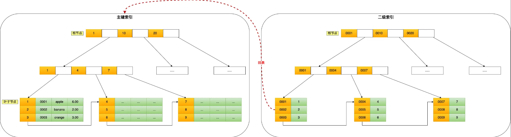

---
markmap:
  colorFreezeLevel: 2
---

# MySQL 中的回表

## 定义

- 回表：使用二级索引（非聚簇索引）查询时，由于二级索引只存索引字段和主键值，查询其他字段需要根据主键去聚簇索引查找实际数据行

## 回表原理

1. 通过二级索引找到主键值
2. 根据主键值查询聚簇索引获取完整数据行
3. 

## 性能影响

- 回表会产生随机 I/O
- 顺序 I/O 快，随机 I/O 慢
- 频繁回表会导致查询效率低下

## 面试速记

- **Q1: 什么是回表？**
  - 二级索引查询字段不全，需要通过主键去聚簇索引查数据
- **Q2: 回表流程？**
  - 二级索引 → 获取主键 → 聚簇索引 → 完整数据
- **Q3: 回表性能影响？**
  - 产生随机 I/O，频繁回表效率低
- **Q4: 如何优化回表？**
  - 使用覆盖索引（查询字段全部在二级索引中）
  - 减少回表次数，提高查询效率
