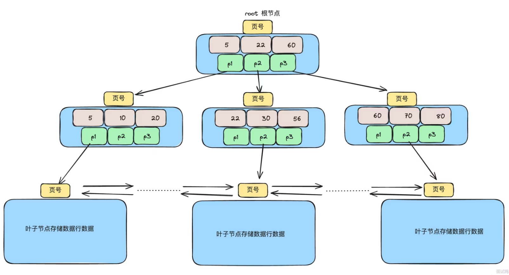
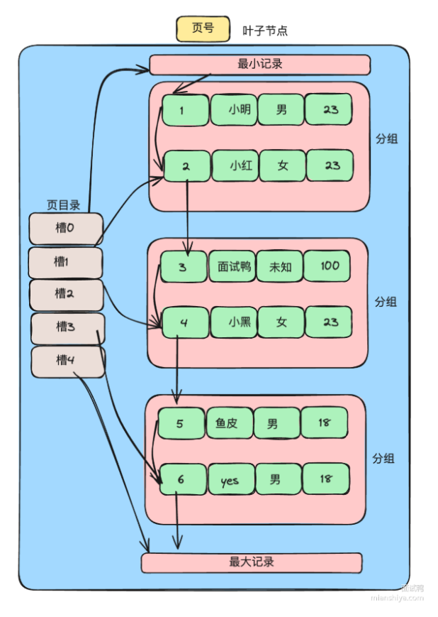

---
markmap:
  colorFreezeLevel: 2
---

# MySQL B+ 树查询数据全过程

## 1. 从根节点开始查找

- 数据查询从 **根节点**开始
- 根节点存储索引键值（不存完整数据）
- 通过 **二分查找** 比较目标值与节点中索引键值
- 确定目标落在哪个子节点区间，沿着分支向下查找

---

## 2. 中间节点

- 内部节点只存索引键和子节点指针
- 每一层都重复“二分定位 + 下钻指针”
- 直到到达叶子节点

---

## 3. 定位叶子节点

- **叶子节点存储实际数据行**（聚簇索引）或主键值（非聚簇索引）
- 每页大小默认 **16KB**
- 每页中存储的数据行不止一条
- 数据行分成**若干组（slot/group）**
  - 第一个分组可能只有 1 条记录
  - 中间分组通常 4~8 条
  - 最后一个分组 1~8 条

---

## 4. 使用页目录定位组

- 叶子节点内部有 **页目录（Page Directory）**
- 页目录存储组在页中的起始位置
- 通过 **二分查找页目录** 可以快速定位到对应的组

---

## 5. 链表遍历组内记录

- 组内记录通过 **单链表** 串联
- 定位到组后，通过链表顺序遍历，找到目标记录

---

## 6. 总结

- **根节点 → 中间节点 → 叶子节点 → 页目录 → 组内链表遍历**
- 每一层查找都保证高效定位
- B+ 树查询时间复杂度为 **O(log n)**，组内链表遍历通常较少，影响可以忽略

---

## 面试速记

- **二分 + 下钻 → 页目录 + 链表** 是 B+ 树查询的标准流程
- **叶子节点存储实际数据**（聚簇索引）或主键（非聚簇索引）
- **页目录 + 组内链表** 是 B+ 树页内部优化的关键

## 可视化

- 
- 
